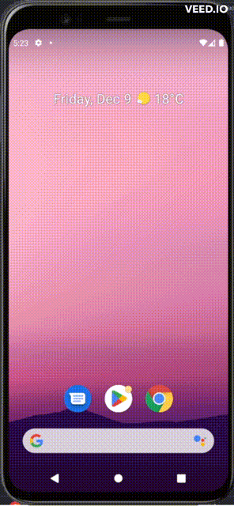

# **Droid-Cafe**

<details>

**<summary>Application Images</summary>**



</details>

### **Code**

<ul>

#### <li>**Java files**

<ul>

<li>

<details>

**<summary>`MainActivity.java`</summary>**

```java
package com.example.droidcafe;

import android.content.Intent;
import android.os.Bundle;

import com.google.android.material.snackbar.Snackbar;

import androidx.appcompat.app.AppCompatActivity;

import android.view.View;

import androidx.navigation.NavController;
import androidx.navigation.Navigation;
import androidx.navigation.ui.AppBarConfiguration;
import androidx.navigation.ui.NavigationUI;

import com.example.droidcafe.databinding.ActivityMainBinding;

import android.view.Menu;
import android.view.MenuItem;
import android.widget.Toast;

public class MainActivity extends AppCompatActivity {

    private AppBarConfiguration appBarConfiguration;
    private ActivityMainBinding binding;

    @Override
    protected void onCreate(Bundle savedInstanceState) {
        super.onCreate(savedInstanceState);

        binding = ActivityMainBinding.inflate(getLayoutInflater());
        setContentView(binding.getRoot());

        setSupportActionBar(binding.toolbar);


        binding.fab.setOnClickListener(new View.OnClickListener() {
            @Override
            public void onClick(View view) {
                Snackbar.make(view, "Replace with your own action", Snackbar.LENGTH_LONG)
                        .setAction("Action", null).show();
            }
        });
    }

    @Override
    public boolean onCreateOptionsMenu(Menu menu) {
        // Inflate the menu; this adds items to the action bar if it is present.
        getMenuInflater().inflate(R.menu.menu_main, menu);
        return true;
    }

    @Override
    public boolean onOptionsItemSelected(MenuItem item) {
        // Handle action bar item clicks here. The action bar will
        // automatically handle clicks on the Home/Up button, so long
        // as you specify a parent activity in AndroidManifest.xml.
        int id = item.getItemId();

        //noinspection SimplifiableIfStatement
        if (id == R.id.action_settings) {
            return true;
        }

        return super.onOptionsItemSelected(item);
    }


    public void displayToast(String message) {
        Toast.makeText(getApplicationContext(), message, Toast.LENGTH_SHORT).show();
    }


    /**
     * Shows a message that the donut image was clicked.
     */
    public void showDonutOrder(View view) {
        showFoodOrder(getString(R.string.donut_order_message));
    }

    /**
     * Shows a message that the ice cream sandwich image was clicked.
     */
    public void showIceCreamOrder(View view) {
        showFoodOrder(getString(R.string.ice_cream_order_message));
    }

    /**
     * Shows a message that the froyo image was clicked.
     */
    public void showFroyoOrder(View view) {
        showFoodOrder(getString(R.string.froyo_order_message));
    }

    /**
     * Displays a toast message for the food order
     * and starts the OrderActivity activity.
     *
     * @parammessage Message to display.
     */
    public void showFoodOrder(String message) {
        displayToast(message);
        Intent intent = new Intent(this, OrderActivity.class);
        startActivity(intent);
    }


}
```

</details>

</li>

<li>

<details>

**<summary>`OrderActivity.java`</summary>**

```java
package com.example.droidcafe;

import androidx.appcompat.app.AppCompatActivity;

import android.os.Bundle;
import android.util.Log;
import android.view.View;
import android.widget.RadioButton;
import android.widget.Toast;

public class OrderActivity extends AppCompatActivity {


    private static final String TAG_ACTIVITY = OrderActivity.class.getSimpleName();


    @Override
    protected void onCreate(Bundle savedInstanceState) {
        super.onCreate(savedInstanceState);
        setContentView(R.layout.activity_order);
    }


    public void displayToast(String message) {
        Toast.makeText(getApplicationContext(), message, Toast.LENGTH_SHORT).show();
    }


    public void onRadioButtonClicked(View view) {
        // Is the button now checked?
        boolean checked = ((RadioButton) view).isChecked();

        switch (view.getId()) {

            case R.id.sameday:
                if (checked)
                    displayToast(getString(R.string.chosen) + getString(R.string.same_day_messenger_service));
                break;

            case R.id.nextday:
                if (checked)
                    displayToast(getString(R.string.chosen) + getString(R.string.next_day_ground_delivery));
                break;

            case R.id.pickup:
                if (checked)
                    displayToast(getString(R.string.chosen) + getString(R.string.pick_up));
                break;

            default:
                Log.d(TAG_ACTIVITY, getString(R.string.nothing_clicked));
                break;
        }
    }
}
```

</details>

</li>

</ul>

</li>

### <li>**XML files**

<ul>

<li>

<details>

**<summary>`content_main.xml`</summary>**

```xml
<?xml version="1.0" encoding="utf-8"?>
<androidx.coordinatorlayout.widget.CoordinatorLayout xmlns:android="http://schemas.android.com/apk/res/android"
    xmlns:app="http://schemas.android.com/apk/res-auto"
    xmlns:tools="http://schemas.android.com/tools"
    android:layout_width="match_parent"
    android:layout_height="match_parent"
    tools:context=".MainActivity">

    <com.google.android.material.appbar.AppBarLayout
        android:layout_width="match_parent"
        android:layout_height="wrap_content"
        android:theme="@style/Theme.DroidCafe.AppBarOverlay">

        <androidx.appcompat.widget.Toolbar
            android:id="@+id/toolbar"
            android:layout_width="match_parent"
            android:layout_height="?attr/actionBarSize"
            android:background="?attr/colorPrimary"
            app:popupTheme="@style/Theme.DroidCafe.PopupOverlay" />

    </com.google.android.material.appbar.AppBarLayout>

    <include layout="@layout/content_main" />

    <com.google.android.material.floatingactionbutton.FloatingActionButton
        android:id="@+id/fab"
        android:layout_width="wrap_content"
        android:layout_height="wrap_content"
        android:layout_gravity="bottom|end"
        android:layout_marginEnd="@dimen/fab_margin"
        android:layout_marginBottom="16dp"
        app:srcCompat="@android:drawable/ic_dialog_email" />

</androidx.coordinatorlayout.widget.CoordinatorLayout>
```

</details>

</li>

<li>

<details>

**<summary>`activity_order.xml`</summary>**

```xml
<?xml version="1.0" encoding="utf-8"?>
<RelativeLayout xmlns:android="http://schemas.android.com/apk/res/android"
    xmlns:app="http://schemas.android.com/apk/res-auto"
    xmlns:tools="http://schemas.android.com/tools"
    android:layout_width="match_parent"
    android:layout_height="match_parent"
    tools:context=".OrderActivity">

    <TextView
        android:id="@+id/order_intro_text"
        android:layout_width="match_parent"
        android:layout_height="wrap_content"
        android:layout_marginTop="@dimen/text_margin_top"
        android:layout_marginBottom="@dimen/text_margin_bottom"
        android:text="@string/choose_delivery_method"
        android:textSize="@dimen/intro_text_size" />

    <RadioGroup

        android:layout_width="match_parent"
        android:layout_height="wrap_content"
        android:layout_below="@id/order_intro_text"
        android:orientation="vertical">

        <RadioButton
            android:id="@+id/sameday"
            android:layout_width="wrap_content"
            android:layout_height="wrap_content"
            android:text="@string/same_day_messenger_service"
            android:onClick="onRadioButtonClicked"/>

        <RadioButton
            android:id="@+id/nextday"
            android:layout_width="wrap_content"
            android:layout_height="wrap_content"
            android:text="@string/next_day_ground_delivery"
            android:onClick="onRadioButtonClicked"/>

        <RadioButton
            android:id="@+id/pickup"
            android:layout_width="wrap_content"
            android:layout_height="wrap_content"
            android:text="@string/pick_up"
            android:onClick="onRadioButtonClicked"/>

    </RadioGroup>


</RelativeLayout>
```

</details>

</li>

</li>

</ul>

</ul>
